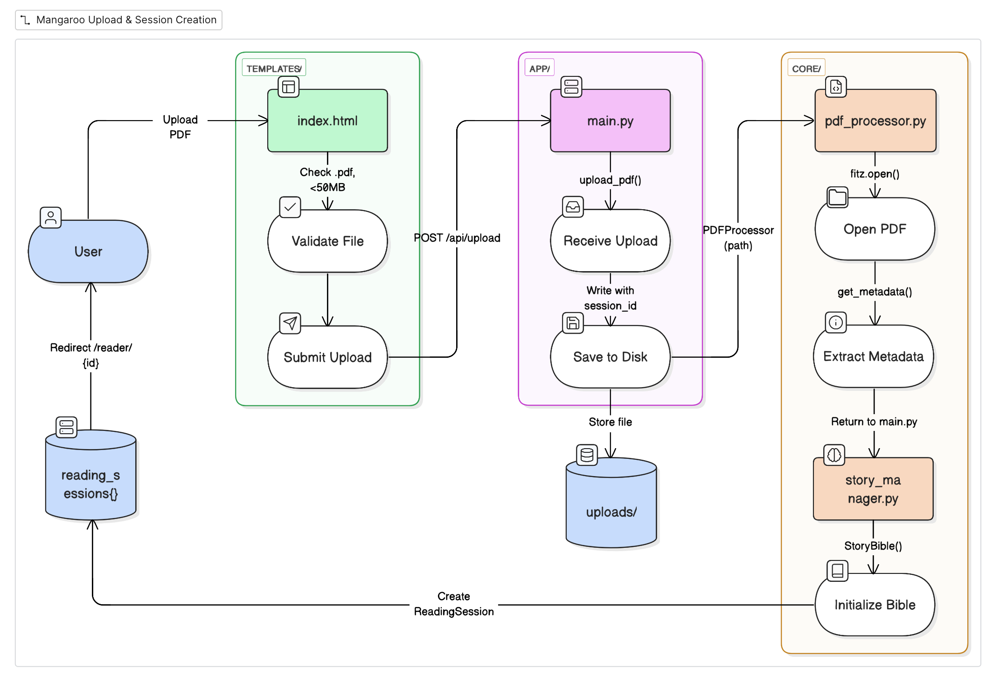
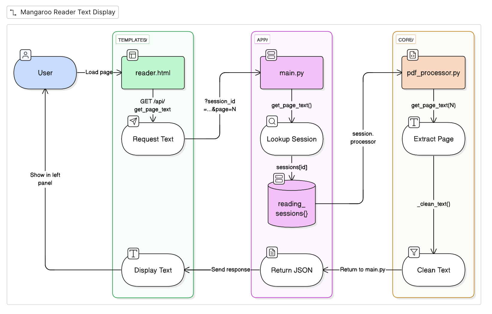
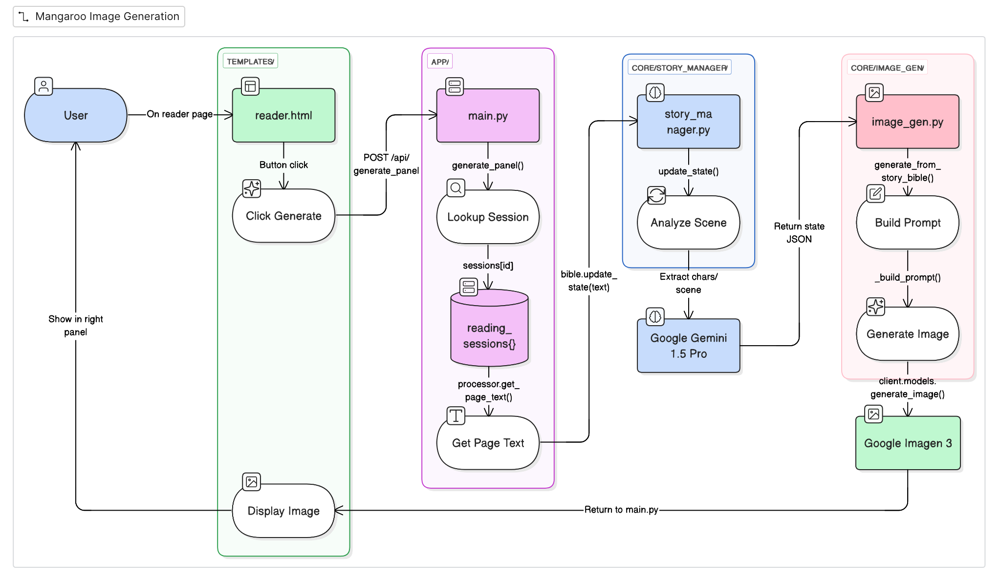
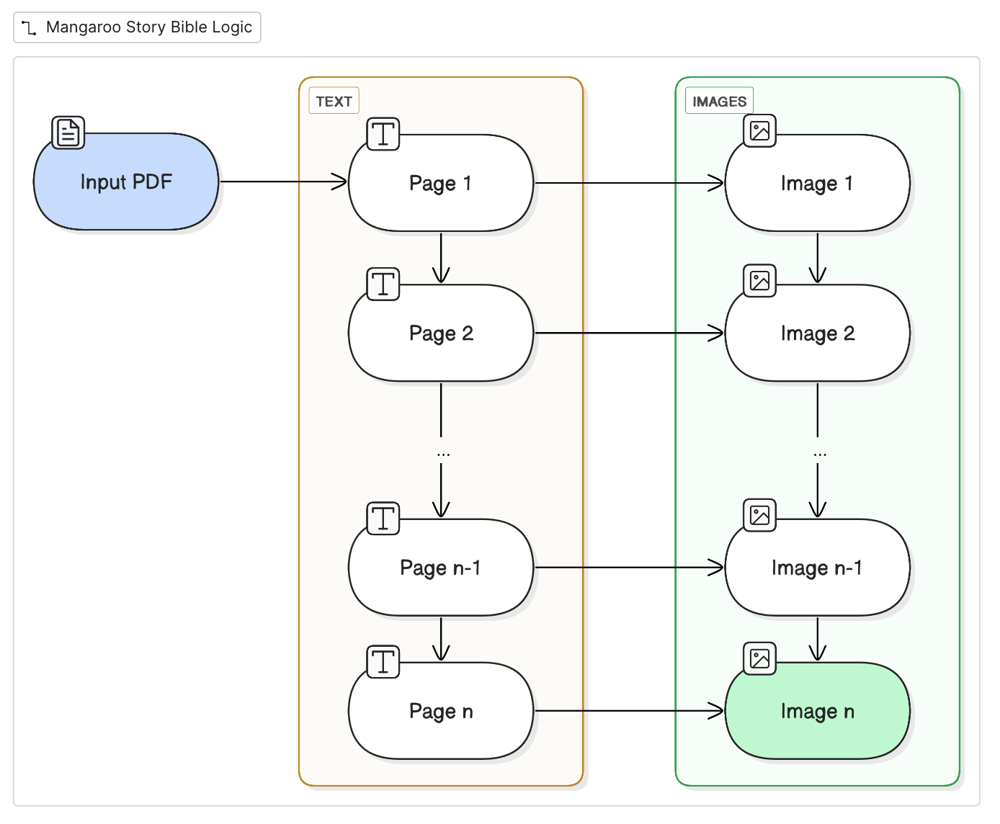

# Mangaroo DevLog

This is the start of an authentic and energetic devlog about why and how I built Mangaroo. 
I will justify all of my design choices by sharing my thought processes for every decision I made as I was building Mangaroo. 
I have also included the most frequently asked questions (and the questions that I asked myself!) into this devlog to answer the most common concerns about the project! 
I would appreciate any feedback you may have!

Instagram, Discord @awzheng

## Important: Devlog Updates Underway

Thanks so much for dropping by the Mangaroo DevLog.
You may notice that some parts of the devlog are currently under construction.
That's because I'm in the process of revamping it to match the quality of my other projects, SageWall and Crawlstars.
See them here: [CrawlStars Devlog](https://github.com/awzheng/CrawlStars/blob/main/devlog.md) and [SageWall Devlog](https://github.com/awzheng/SageWall/blob/main/devlog.md)

With WaterlooWorks and ECE 1B filling up my schedule, progress has been halted for now.
I will continue to update the devlog as I make progress on Mangaroo!
Thank you for your patience!
Please show my other projects your support by reading my dev journey!

## Why I made Mangaroo

I've always wondered about the psychology behind what makes some books more memorable and "readable" than others.
How come it was so easy for me as a child in the early 2010s to be content with rereading Diary of a Wimpy Kid and Pokemon books over and over again?
By no means was I a picky reader.
My favourite genre of books was still nonfiction, but fiction has always had a soft spot in my heart.

It's quite strange as well.
I personally believe that these kinds of books were the earliest forms of "brainrot" that I was introduced to, namely books like Diary of a Wimpy Kid and Big Nate.
They were undeniably below the reading level of their target audience (middle school kids), but I found them engaging enough to always drop a quick 15-minute flash read whenever I bumped into them at the bookstore or library.

I also found the same effect when interacting with manga.
By that, I'm talking about reading the limited amount of manga that could be found in Toronto libraries and bookstores.
(I wasn't immersed into the online scene as a child, but I'm very thankful for that.)

However, that doesn't mean that I don't like manga.
Lots of manga are so satisfying to read and reread over and over again since they're immersive and dynamic.
They're a super effective medium for storytelling, and I can see it working for nonfiction works as well, such as biographies and documentaries.

Big disclaimer: I don't support AI art, but since my project is a non-monetized personal adventure, I'm fine with enjoying the results of AI labour in a system that I designed personally.

> Andrew! Do you read manga?

No, not at the moment, but I used to (sometimes), and I'm open to suggestions!

# Episode 1: Starting Out

Now that we got the intro out of the way (please don't attack me for "using AI art!"), we can start the system design process (my favourite).

The main intention behind making Mangaroo was to build something using the FastAPI framework.

> Andrew! What's FastAPI? What's a framework?

Before I explain what FastAPI is, let me explain what a framework is.

A framework is a prebuilt collection of code and tools that we use to build our app.
It provides structure to the chaos of our app and is gonna make development a lot smoother.

I chose FastAPI to be the foundation of Mangaroo since it's the perfect tool to call Gemini's API while also practicing my software and system design skills.

## Project Diagrams

I have to confess that I spend 3 entire days just figuring out how to design and lay out the system on eraser.io.
I have sooo many failed attempts that you can view in the appendix.
I had to redo my diagrams and decided to follow the same format as my more recent projects, SageWall and CrawlStars.

See them here: [CrawlStars Devlog](https://github.com/awzheng/CrawlStars/blob/main/devlog.md) and [SageWall Devlog](https://github.com/awzheng/SageWall/blob/main/devlog.md)

### Upload Path

### Text Display Path

### Image Generation Path

### Story Bible Logic

