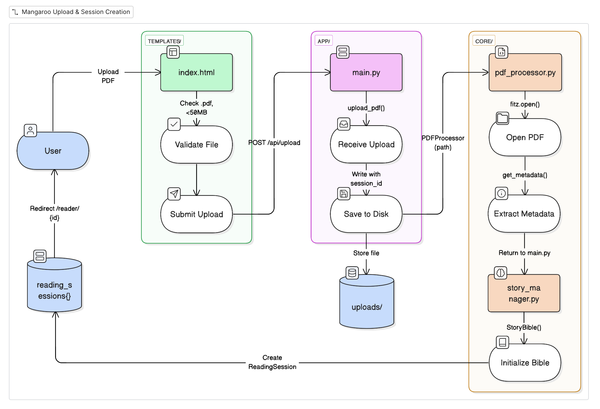
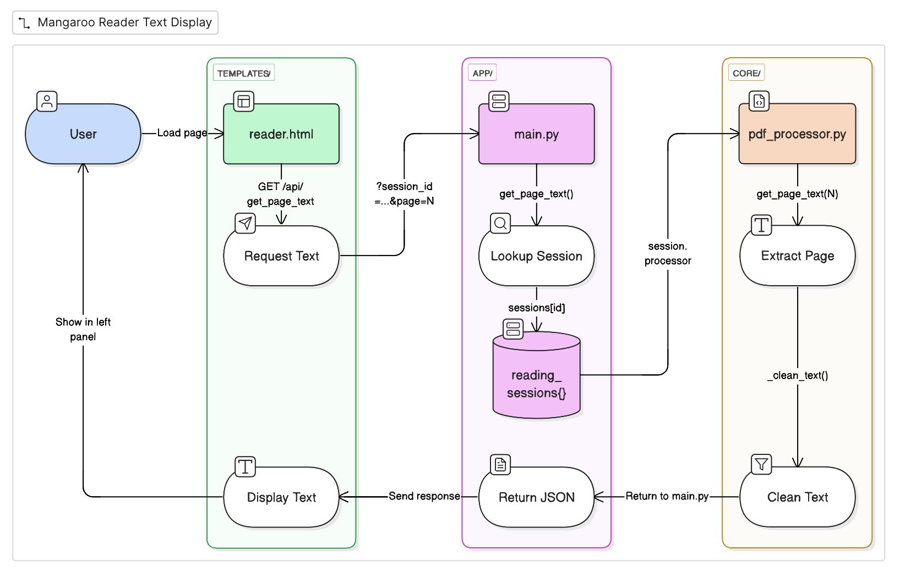
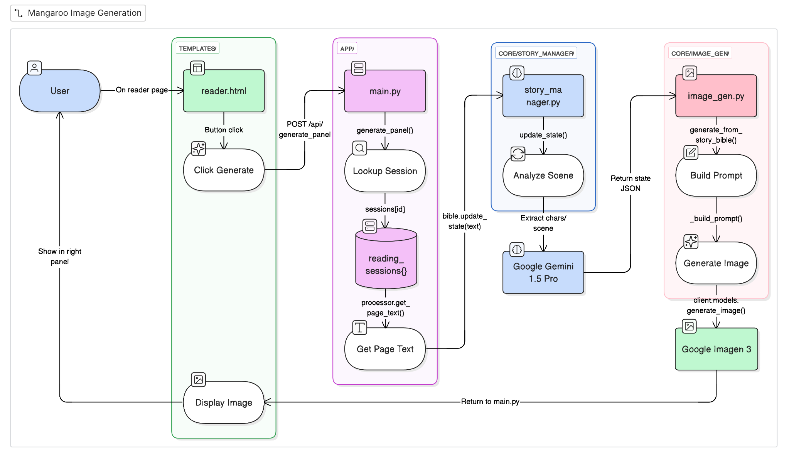
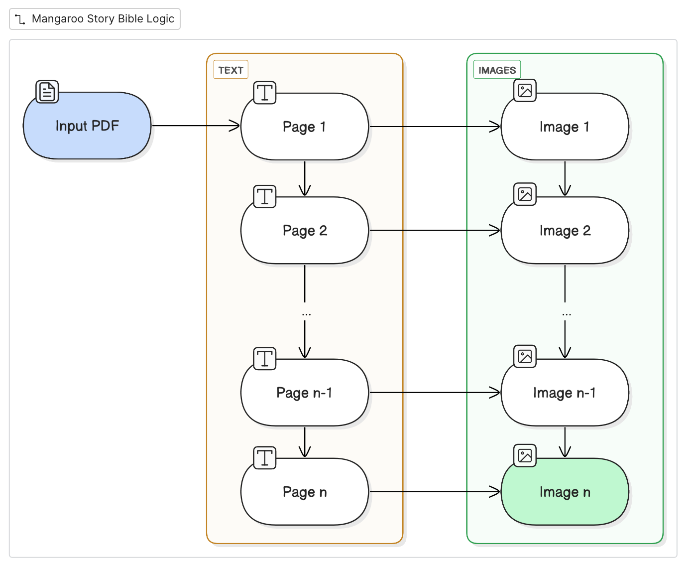

# Mangaroo DevLog

This is the start of an authentic and energetic devlog about why and how I built Mangaroo. 
I will justify all of my design choices by sharing my thought processes for every decision I made as I was building Mangaroo. 
I have also included the most frequently asked questions (and the questions that I asked myself!) into this devlog to answer the most common concerns about the project! 
I would appreciate any feedback you may have!

Instagram, Discord @awzheng

## Important: Devlog Updates Underway

Thanks so much for dropping by the Mangaroo DevLog.
You may notice that some parts of the devlog are currently under construction.
That's because I'm in the process of revamping it to match the quality of my other projects, SageWall and Crawlstars.
See them here: [CrawlStars Devlog](https://github.com/awzheng/CrawlStars/blob/main/devlog.md) and [SageWall Devlog](https://github.com/awzheng/SageWall/blob/main/devlog.md)

With WaterlooWorks and ECE 1B filling up my schedule, progress has been halted for now.
I will continue to update the devlog as I make progress on Mangaroo!
Thank you for your patience!
Please show my other projects your support by reading my dev journey!

## Why I made Mangaroo

I've always wondered about the psychology behind what makes some books more memorable and "readable" than others.
How come it was so easy for me as a child in the early 2010s to be content with rereading Diary of a Wimpy Kid and Pokemon books over and over again?
By no means was I a picky reader.
My favourite genre of books was still nonfiction, but fiction has always had a soft spot in my heart.

It's quite strange as well.
I personally believe that these kinds of books were the earliest forms of "brainrot" that I was introduced to, namely books like Diary of a Wimpy Kid and Big Nate.
They were undeniably below the reading level of their target audience (middle school kids), but I found them engaging enough to always drop a quick 15-minute flash read whenever I bumped into them at the bookstore or library.

I also found the same effect when interacting with manga.
By that, I'm talking about reading the limited amount of manga that could be found in Toronto libraries and bookstores.
(I wasn't immersed into the online scene as a child, but I'm very thankful for that.)

However, that doesn't mean that I don't like manga.
Lots of manga are so satisfying to read and reread over and over again since they're immersive and dynamic.
They're a super effective medium for storytelling, and I can see it working for nonfiction works as well, such as biographies and documentaries.

Big disclaimer: I don't support AI art, but since my project is a non-monetized personal adventure, I'm fine with enjoying the results of AI labour in a system that I designed personally.

> Andrew! Do you read manga?

No, not at the moment, but I used to (sometimes), and I'm open to suggestions!

# Episode 1: Starting Out

Now that we got the intro out of the way (please don't attack me for "using AI art!"), we can start the system design process (my favourite).

The main intention behind making Mangaroo was to build something using the FastAPI framework.

## Understanding FastAPI

> Andrew! What's FastAPI? What's a framework?

Before I explain what FastAPI is, let me explain what a framework is.

A framework is a prebuilt collection of code and tools that we use to build our app.

> No! That's a library! Wait, what's the difference between a library and a framework?

Well said!
Yes, a library is a collection of tools.
However, what makes a framework different from a library is the inversion of control.

FastAPI controls the flow of our app and calls our code when specific events trigger HTTP requests (such as user uploading a PDF or clicking Generate). 

As an example, let's say that a reader clicks the Generate button on page 1 of the pdf that they uploaded.
Here's the sequence of events:
1. User clicks "Generate" in the browser
2. JavaScript sends an HTTP POST request to `/api/generate_panel'
3. FastAPI is always listening, and it receives the HTTP request.
4. We get to tell FastAPI exactly what to do when these events trigger. In this case, it's the `generate_panel()` function in python.

FastAPI provides structure to the chaos of our app and is gonna make development a lot smoother.

To me, that's a meaningful advantage in terms of efficiency and productivity.
I chose FastAPI to be the foundation of Mangaroo since it's the perfect tool to call Gemini and Imagen APIs while also practicing my software and system design skills.

Yes, remember that we're using using two AIs in sequence: Gemini and Imagen.
FastAPI natively supports Python's `async` and `await` keywords, which is perfect for our use case. 

> Andrew! What's async and await? Why not just use threads?

Async is way more efficient than threads!
While we wait for Gemini and Imagen APIs to respond to our requests, we can still handle other eaders' requests without the cost of thread context switching.

The server will be able to handle requests from multiple users (readers) concurrently.

For example, while we wait for Gemini to handle a request from Reader A, FastAPI can still start to process a request from Reader B.
The flow of the app won't be held up for any other users by waiting for Gemini and Imagen to respond to Reader A's request.

FastAPI has some other useful features too, notably Swagger UI. 
Swagger is automatically generated by FastAPI at `/docs` (by visiting `http://localhost:8000/docs`).

If you're a fan of these concepts, I recommend checking out the [CrawlStars Devlog](https://github.com/awzheng/CrawlStars/blob/main/devlog.md) which contains concurrency and REST API concepts using Golang and MongoDB.

> Andrew! What? How does swagger generate the docs/documentation automatically? What's the mechanism behidn it?

Swagger docs are generated automatically by FastAPI by the following clues.
- Our route decorators such as `@app.post("/api/upload")`, aka a special syntax that links a function to a specific HTTP request
- Python gives type hints in the function signature, aka defining the expected input and output types
- Docstrings in route functions (if applicable)

It also provides a `/redoc` endpoint as an alternative interface (by visiting `http://localhost:8000/redoc`).
It makes our API documentation way more human-readable so that we can test our endpoints and easily identify bugs.

> Andrew, I now understand what FastAPI is. However, what's Uvicorn?

Uvicorn is an ASGI server that runs our FastAPI application written in python.
ASGI stands for Async Server Gateway Interface, making it perfect for our async FastAPI application.
It also supports other features in case I wish to expand Mangaroo or experiment with other tools:
- WebSocket support
- HTTP/2 support
- HTTP/3 support
- Long-lived connections (reusing connections for multiple requests)

When we run `uvicorn app.main:app`, we're essentially saying "Uvicorn, please run our FastAPI app defined in app/main.py".

## Project Diagrams

I have to confess that I spend 3 entire days just figuring out how to design and lay out the system on eraser.io.
I have sooo many failed attempts that you can view in the appendix.
I had to redo my diagrams and decided to follow the same format as my more recent projects, SageWall and CrawlStars.

See them here: [CrawlStars Devlog](https://github.com/awzheng/CrawlStars/blob/main/devlog.md) and [SageWall Devlog](https://github.com/awzheng/SageWall/blob/main/devlog.md)

### Upload Path



### Text Display Path



### Image Generation Path



### Story Bible Logic



> Andrew! Story bible? What's a story bible?

The story bible is a class that contains the context of the story in order to generate images that are precise and consistent to the reader's session experience.

For example, let's say we **didn't** use a story bible. If we sent two completely seperate requests to generate images for consecutive pages, the style of the images generated could be completely different.

We *could* throw all our credits by asking Gemini to repeatedly read images and generate a new image based on the images' visual style, but that would get very slow for novels with hundreds of pages and tons of context.

By storing data from each consecutive page using our handy story bible, the AI won't get lost or lost context, thus we'll end up with more consistent images.

### Project Structure

I aimed for a general three-layer architecture as shown below.
```
[Green] Presentation Layer
    ↓
[Purple] Business Logic Layer
    ↓
[Other] Data Access Layer
```
Currently, the business logic layer makes direct external API calls to Gemini and Imagen.
In a larger system, I'd use the Data Access layer to handle external API calls.

And here's the project's core file structure:

```
Mangaroo/
├── api/
│   ├── __init__.py
│   └── index.py                    # Vercel serverless entry point
├── app/
│   ├── __init__.py
│   ├── main.py                     # FastAPI application & routes
│   ├── core/
│   │   ├── __init__.py
│   │   ├── config.py               # Settings & environment variables
│   │   ├── pdf_processor.py       # PDF text extraction
│   │   ├── story_manager.py       # Story Bible (Gemini analysis)
│   │   └── image_gen.py           # Image generation (Imagen 3)
│   ├── static/
│   │   └── css/                    # Stylesheets
│   └── templates/
│       ├── index.html              # Upload page
│       └── reader.html             # Reading interface
├── uploads/                        # Temporary PDF storage
├── .env                            # API keys (not in git)
├── requirements.txt                # Python dependencies
├── vercel.json                     # Vercel deployment config
└── README.md
```

Here are some brief descriptions of the project structure in table format:

| Directory/File | Description | Notable Member Functions |
|----------------|-------------|-------------------------|
| `api/index.py` | Vercel serverless entry point that imports the FastAPI app for deployment | N/A |
| `app/main.py` | Main FastAPI application with all route handlers and session management | `upload_pdf()`, `get_page_text()`, `generate_panel()`, `reader()`, `ReadingSession` class |
| `app/core/config.py` | Configuration management using Pydantic to load environment variables from .env file | `get_settings()`, `ensure_upload_dir()`, `Settings` class |
| `app/core/pdf_processor.py` | Handles PDF file operations and text extraction using PyMuPDF | `PDFProcessor.open()`, `PDFProcessor.get_page_text()`, `PDFProcessor.get_metadata()`, `extract_page_text()` |
| `app/core/story_manager.py` | Story Bible that maintains narrative context across pages using Gemini API | `StoryBible.update_state()`, `StoryBible.get_image_prompt()`, `StoryBible._build_analysis_prompt()` |
| `app/core/image_gen.py` | Manga panel generation using Google Imagen 3 API | `ImageGenerator.generate_panel()`, `ImageGenerator.generate_from_story_bible()`, `get_image_generator()` |
| `app/templates/` | Jinja2 HTML templates for the web interface | N/A |
| `app/static/css/` | CSS stylesheets for the frontend | N/A |
| `uploads/` | Directory for temporary storage of uploaded PDF files (local dev only, uses /tmp on Vercel) | N/A |

## My plans to scale Mangaroo's System Design

Yes, I know, lots of people tend to stuff their future plans to the bottom of their writing.
However, since I always start my devlog Episode 1 from a system design standpoint, I'm willing to show off the potential of Mangaroo and get a clear idea of what I can do to scale it.

Let's face it, I'm currently in 1B and I haven't had the time to scale Mangaroo yet.
Lots of my time after building Mangaroo has been spent on CrawlStars, SageWall, school, and co-op search.

However, my plans for the future are to scale this project using my knowledge of distributed systems gained from my other projects, CrawlStars and SageWall.
I'll be revisting the Mangaroo system design in the future and here are some of my plans to take Mangaroo to the next level:

> Andrew, your story bible works for sessions, but how would we scale Mangaroo to a distributed system?

We would have to store the story bibles in a database.
I would choose a database such as MongoDB since it's a NoSQL database that's easy to scale and provides a lot of features out of the box.

A reasonable step in-between where we are now (sessions lost on server refresh) and database storage heaven is to store session IDs in cookies or tokens. 
Additionally, we should implement session cleanup in order to prevent memory leaks.

We could also store the user's PDF file uploads on a cloud database such as AWS S3, which I used in SageWall (read the devlog here: https://github.com/andrewzheng/SageWall/blob/main/devlog.md)

Now that we've established the scope and functions behind Mangaroo, let's get building!

# Episode 2: Upload Path

My devlogs follow the path of data flow through the system diagram. We'll begin by examining `main.py` (and skip the boring frontend part!)and follow through all the functions in the upload path.


## main.py 

The general path within `main.py` includes session creation, the upload route, and saving the upload path to the session.

### ReadingSession

`ReadingSession` is the backbone of our upload flow. Each PDF upload creates one session object that coordinates the PDF processor, Story Bible, and user state. 

> Andrew! Why create a whole class for sessions? Why not just use a dictionary to store PDF paths?

Making a class is better because classes group both data and methods (functions).
Each session manages its own cleanup using `close()`, and sets its own processor and story bible.
It also includes type safety, making it easier to understand what a session contains.
Each user's ReadingSession is composed of other objects such as PDFProcessor and StoryBible.
Thus, the typical life cycle for a ReadingSession is construction → active use → cleanup.

```python
class ReadingSession:
    """
    Represents an active reading session.
    
    Each time someone uploads a PDF, we create a ReadingSession.
    It keeps track of:
    - The PDF file they're reading
    - Their Story Bible (character/scene context)
    - Which page they're on
    
    Think of it like a bookmark that also remembers
    what all the characters look like.
    """
    
    def __init__(self, pdf_path: str, filename: str):
        """
        Create a new reading session.
        
        Args:
            pdf_path: Where the uploaded PDF is saved
            filename: Original name of the file
        """
        self.pdf_path = pdf_path          # Path to the saved PDF
        self.filename = filename          # Original filename for display
        self.story_bible = StoryBible()   # AI context tracker
        self.current_page = 0             # Track which page user is on
        
        # Open the PDF and get basic info
        self.processor = PDFProcessor(pdf_path)
        self.processor.open()
        self.total_pages = self.processor.total_pages
        self.metadata = self.processor.get_metadata()
        
    def close(self):
        """
        Clean up when the session ends.
        
        IMPORTANT: Always clean up resources!
        - Close open files
        - Free up memory
        """
        self.processor.close()
```

As you can see, the excerpt above just contains our init and close functions which are just the fundamentals of object-oriented programming.
`close()` is important to avoid memory leaks.

> Andrew! Why not just use a dataclass or Python dictionaries?

Dataclasses are a good alternative for simple data-only storage, but they don't provide the same level of functionality as classes.
Dictionaries are too simple for our needs and don't provide type safety (in Python).
Mangaroo is a very object-oriented system and classes are a natural fit.

Let's leave dictionaries to the LeetCode lunatics.

> Andrew! What happens when the server restarts?

At the moment, when the server restarts, user sessions are lost.

> Seriously? How do you plan to scale this?

We could store the sessions in cookies or a database if we wanted to.
If you love databases, I would highly recommend checking out [CrawlStars](https://github.com/andrewzheng/CrawlStars) (MongoDB) and [SageWall](https://github.com/andrewzheng/SageWall) (AWS S3)!

Also, I don't plan to commercialize this anytime soon.
I would never try to scale something using AI art.
Gross behaviour!
This project is more of a for-fun exercise to prove that I can build a full-stack app using FastAPI.

### upload_pdf() Route Handler

`upload_pdf()` includes the entire upload flow: validation → storage → session creation → response.
It sounds like a lot, but don't worry, we'll go through it step by step.

```python
@app.post("/api/upload")
async def upload_pdf(file: UploadFile = File(...)):
    """
    Upload a PDF file and create a reading session.
    
    ROUTE: POST /api/upload
    
    FLOW:
    1. Receive the uploaded file
    2. Validate it (is it a PDF? is it too big?)
    3. Save it to the uploads folder
    4. Create a ReadingSession
    5. Return the session ID so frontend can redirect to reader
    """
    # ---- Step 1: Validate file type ----
    if not file.filename.lower().endswith('.pdf'):
        raise HTTPException(status_code=400, detail="Only PDF files are allowed")
    
    # ---- Step 2: Check file size ----
    settings = get_settings()
    contents = await file.read()  # Read the file contents into memory
    
    if len(contents) > settings.max_file_size_mb * 1024 * 1024:  # Convert MB to bytes
        raise HTTPException(
            status_code=400, 
            detail=f"File too large. Maximum size is {settings.max_file_size_mb}MB"
        )
    
    # ---- Step 3: Generate unique session ID ----
    session_id = str(uuid.uuid4())[:8]
    
    # ---- Step 4: Save the file ----
    safe_filename = f"{session_id}_{file.filename}"
    file_path = Path(UPLOAD_DIR) / safe_filename
    
    with open(file_path, "wb") as f:  # "wb" = write binary
        f.write(contents)
    
    # ---- Step 5: Create reading session ----
    try:
        session = ReadingSession(str(file_path), file.filename)
        reading_sessions[session_id] = session  # Store in our dictionary
        
        return JSONResponse({
            "success": True,
            "session_id": session_id,
            "filename": file.filename,
            "total_pages": session.total_pages,
            "metadata": session.metadata,
            "redirect_url": f"/reader/{session_id}"
        })
    except Exception as e:
        # If something goes wrong, clean up the file we saved
        os.remove(file_path)
        raise HTTPException(status_code=500, detail=f"Failed to process PDF: {str(e)}")
```

It starts off by identifying as an API call with `@app.post("/api/upload")`.
Then, it follows the steps below.

#### 1. Validate file type

A simple check with the file name to ensure that it's a valid PDF file.
In some systems such as testing the app on Google Chrome on MacOS, the upload file window only allows PDF uploads anyway.
Very convenient!

#### 2. Validate file size

After converting MB to bytes, we check that the file is smaller than `settings.max_file_size_mb` which is defined as 50MB in settings from `get_settings()` which retrieves information from `app/core/config.py`.
Here's the excerpt from `config.py` to prove it:

```python
    # Maximum file size allowed (in megabytes)
    # Prevents users from uploading huge files that slow down the server
    max_file_size_mb: int = 50
```
Whew!

> Andrew! Why do we validate both the file extension and file size? Why can't we just try to open it as a PDF?

Slow down, tiger!
It's better to check early and fail fast than to get stuck too deep in a sunk cost.
Extension checking is a super cheap, fast and intuitive way to check if it's a PDF file.

> Andrew! What's the worst that could happen without validation?

Our app might process a malicious file upload causing server crashes or DoS attacks, such as someone uploading a 10GB file.
That's why we have multiple layers of validation to filter out evil users.

> Andrew! What does `await file.read()` do?

Good eye! `await` is one of our FastAPI async keywords.
`await` is used to pause the execution of the current function (and let the cpu work on other tasks)until the awaited operation completes.
In this case, it pauses the `upload_pdf()` function until the file is read.
In the meantime, our app can work on handling other readers' requests, generating images, and managing the story.

Let's explain it in Mickey Mouse terms.
Think of Mangaroo as a pizzeria with a single chef (FastAPI).
It takes a while for the pizza (PDF File) to bake (process).
A lazy (synchronous) chef would stand there and watch the pizza bake until it's done.
They would freeze and refuse to take other orders.
An efficient (asynchronous) chef, on the other hand, would use the downtime to take other orders, prepare ingredients, and clean the kitchen.

> Andrew! Would `upload_pdf()` still work without `await`?

Unfortunately not.
If it takes too long to read one user's PDF file, our app would be stuck processing that request and wouldn't be able to handle other users' requests.

Using the pizzeria analogy, the lazy chef would be staring at the oven as the customers wait in line, the other pizzas remain unmade, and the kitchen gets dirtier.

Thus, step 2 is an async file size check: the second half of the validation process for reader A's upload.
I would have used an em dash if it wasn't overridden by AI.

#### 3. Generate unique session ID

After validating file input, we generate a Universally Unique Identifier (UUID) for reader A's upload.

> Andrew! Why use UUID instead of incrementing numbers (1, 2, 3...) for session IDs? What does `[:8]` do?

UUID is a 128-bit number that is used to identify information in computer systems.
This means that it can range in value from 0 to 2^128 - 1 (think 0...0 to 1...1 in binary), which is approximately 3.4 x 10^38.
Thus, since there are so many possible values, it's virtually impossible for multiple users to share a UUID.
One user won't accidentally access another user's session.
Since the UUID can get really long (making it hard to render/read), `[:8]` is used to truncate it to the first 8 characters to make it more human-readable.

#### 4. Save the file

Step 4 is quite simple.
We save the file to a session directory with the session ID + original filename as the path.
This is represented in the system design diagram as the cylindrical uploads/ node!

> Andrew! Why save the file instead of just keeping it in memory?

It's better to save the file for FastAPI to handle it faster.

#### 5. Create reading session

Finally it's time to create a reading session.
It calls the `ReadingSession` constructor we defined earlier and stores key information such as session ID, file path, and total pages in a JSON response.

Finally, we're ready to start processing the PDF and extract text to generate images with!

## pdf_processor.py

Moving along the path of the system design diagram: after saving the PDF to the session uploads/ directory, we move on to `pdf_processor.py` to process the PDF.

The `PDFProcessor` class is essentially a wrapper for the the PyMuPDF (fitz) library to safely handle PDF operations. 
It follows the open/close pattern for resource management.

```python
class PDFProcessor:
    """
    Handles PDF file operations and text extraction.
    
    WHAT IS A CLASS?
    - A class is like a blueprint for creating objects
    - It groups related functions (methods) and data together
    - PDFProcessor is our "tool" for working with one PDF file
    
    HOW TO USE:
        processor = PDFProcessor("mybook.pdf")  # Create processor
        processor.open()                         # Open the PDF
        text = processor.get_page_text(0)       # Get page 1 text
        processor.close()                        # Close when done
    """
    
    def __init__(self, pdf_path: str):
        """
        Initialize (set up) the PDF processor.
        
        __init__ is a special method that runs when you create a new object.
        
        Args:
            pdf_path: The file path to the PDF (e.g., "uploads/mybook.pdf")
        """
        self.pdf_path = Path(pdf_path)
        
        # These will be set when we open the PDF
        # The underscore prefix (_doc) indicates "private" - internal use only
        self._doc: Optional[fitz.Document] = None  # The PDF document object
        self._total_pages: int = 0                  # Number of pages
        
    def open(self) -> bool:
        """
        Open the PDF document for reading.
        
        WHY SEPARATE OPEN/CLOSE?
        - Opening a file takes resources (memory)
        - We open once, do all our work, then close
        - This is more efficient than opening for each operation
        
        Returns:
            True if the PDF opened successfully, False if there was an error
        """
        try:
            self._doc = fitz.open(self.pdf_path)
            self._total_pages = len(self._doc)
            return True
        except Exception as e:
            print(f"Error opening PDF: {e}")
            return False
    
    def close(self):
        """
        Close the PDF document and free up memory.
        
        IMPORTANT: Always close files when done!
        """
        if self._doc:
            self._doc.close()
            self._doc = None
    
    @property
    def total_pages(self) -> int:
        """
        Get total number of pages in the PDF.
        
        @property decorator makes this act like a variable:
        - Instead of: processor.total_pages()
        - You write: processor.total_pages
        """
        return self._total_pages
```

Some key notes about `PDFProcessor`:

- The constructor `__init__` contains two key variables: the PDF path and total number of pages.
- `open` opens the user's uploaded PDF to start reading.
- `close` closes the user's PDF to prevent memory leaks.

The open/close pattern is a common practice for file handling in other languages.
Now let's answer your barrage of FAQs:

> Andrew! What's `@property`?

`@property` is a Python decorator.
Decorators are a tag that takes the function below as an argument to be modified, creating a new function.
Thus, `@property` modifies the `total_pages` method to act like an input variable for the `PDFProcessor` class.

> What function do we get from `@property`?

We get the function of being able to access the `total_pages` variable without having to call the `total_pages()` method.

> Why do we need to access `total_pages` without calling the `total_pages()` method?

It makes our future code (which takes `total_pages` as a variable) much easier to read and maintain.
It also made me a more well-rounded and knowledgeable software dev overall!

> Andrew! Why use a wrapper for PyMuPDF instead of using it directly?

Creating a wrapper class is a much better practice in software engineering.
It makes our code way easier to read and maintain.
It can be kinda compared to creating helper functions for custom classes in your object-oriented programming class in order to access typically private or protected variables/functions.

> Andrew! What even is PyMuPDF and why did you choose it over other PDF libraries?

PyMuPDF is a Python binding (a wrapper for code written in other programming languages) for the MuPDF library which is a framework written in C.
That means that, in a way, we have gifted Mangaroo the power of multiversal travel.
There are also some alternatives to PyMuPDF, such as PyPDF2 (slower, but more lightweight) and pdfplumber (better for tables).
We've imported `pymupdf` by the name of `fitz` since it's a tutorial convention.
It's done a great job at extractin text, and it also has the capability to extract images, metadata, and even render pages.

> Andrew! Why did you separate `__init__()` and `open()`? Why not open the PDF in the constructor?

This comes down the the fact that seperating the initialization (construction) and the function (opening) of an object is a much better practice than keeping them jumbled together.
By seperating `__init__()` and `open()`, we can read and debug the code much more efficiently.
It also makes the resource lifetime explicitly clear.
Thus, we can first focus on creating the `PDFProcessor` object, and then we can decide whether to open the PDF later on.

As an added bonus, our system design diagram (user upload data path) is clear and linear, making it super easy to read and follow, especially for beginners!

## story_manager.py

`StoryBible` is the absolute hero of quantifying what I've achieved through Mangaroo.
By running some calculations, I've narrowed down the fact that I reduced context token usage by **92%** by storing plot context in a JSON instead of forcing Gemini to reread the story and rewatch all of our images every time we want to create a new page (in order to preserve a relatively consistent user experience).

Essentially, the `StoryBible` class maintains narrative context across pages. 
It starts with an empty state and builds up character/scene knowledge (extracted and returned by Gemini) as we read.

```python
class StoryBible:
    """
    The Story Bible maintains narrative and visual context across pages.
    
    ANALOGY: Think of it like a TV show's "series bible"
    - Character sheets: What does each character look like?
    - Setting guides: What does each location look like?
    - Plot summary: What's happened so far?
    
    This ensures visual consistency - like how animated characters
    always look the same episode to episode.
    """
    
    def __init__(self):
        """
        Initialize the Story Bible with an empty state.
        
        The state dictionary tracks everything we know about the story.
        It starts empty and builds up as we read more pages.
        """
        # The main state dictionary - this is what we're tracking
        self.state: Dict = {
            # Description of the current scene for the manga panel
            "current_scene": "",
            
            # List of characters with their visual descriptions
            # Each character: {name, appearance, clothing, expression, position}
            "characters": [],
            
            # Recommended art style for this scene
            # e.g., "dramatic shadows", "soft lighting", "action lines"
            "visual_style": "",
            
            # Running summary of the story so far
            "story_summary": "",
            
            # Emotional tone: "tense", "romantic", "action-packed", etc.
            "mood": "",
            
            # When the scene takes place
            "time_of_day": "",
            
            # Background/setting details
            "location_details": ""
        }
        
        # Set up the connection to Google's AI
        self._configure_genai()
        
    def _configure_genai(self):
        """
        Configure the Google Generative AI client.
        
        This sets up our connection to Google's Gemini AI.
        We need a valid API key for this to work.
        """
        settings = get_settings()
        
        if settings.gemini_api_key:
            # Configure the library with our API key
            genai.configure(api_key=settings.gemini_api_key)
            
            # Create a Gemini 1.5 Pro model instance
            self.model = genai.GenerativeModel('gemini-1.5-pro')
        else:
            # No API key - AI features won't work
            self.model = None
```

`StoryBible` contains a dictionary that tracks essential information such as:
- `current_scene`
- `characters`
- `visual_style`
- `story_summary`
- `mood`
- `time_of_day`
- `location_details`

Which we initialize as empty.

> Andrew! What is the "Story Bible" concept? Where does this term come from?

Maintaining a Story Bible (aka show bible or pitch bible) is a practice used in the film industry to keep writing and design on track.
It's not just a word that I made up!
Read more about it on [Wikipedia](https://en.wikipedia.org/wiki/Bible_(screenwriting)).

Having a story bible gives Mangaroo very distinct advantages as a standalone FastAPI app rather than a generic AI wrapper:

- OOP system design
- 92% reduced context token usage
- O(1) memory complexity
- Much faster image generation
- Consistent image generation aka lower chance of AI slop

After initializing the `StoryBible`, we call `self._configure_genai()` to configure the connection to Google's AI.

> Andrew! Why Gemini 1.5 Pro instead of Flash or other models?

At the time of making Mangaroo (Nov 2025), Gemini 1.5 Pro was the best model for my use case.
It's great at handling JSON format extraction (character names, descriptions) and reasoning with complex tasks such as extracting story context.
I'm thinking of switching to Gemini 3 Flash in the future.

Anyway, now that our environment is set up and configured correctly, we've reached all nodes in our Upload & Sessino Creation diagram path. Time to move onto displaying text!

# Episode 3: Reader Text Display Path

Reader text display is a simple process for what is essentially a glorified e-reader that helps us extract image context.

